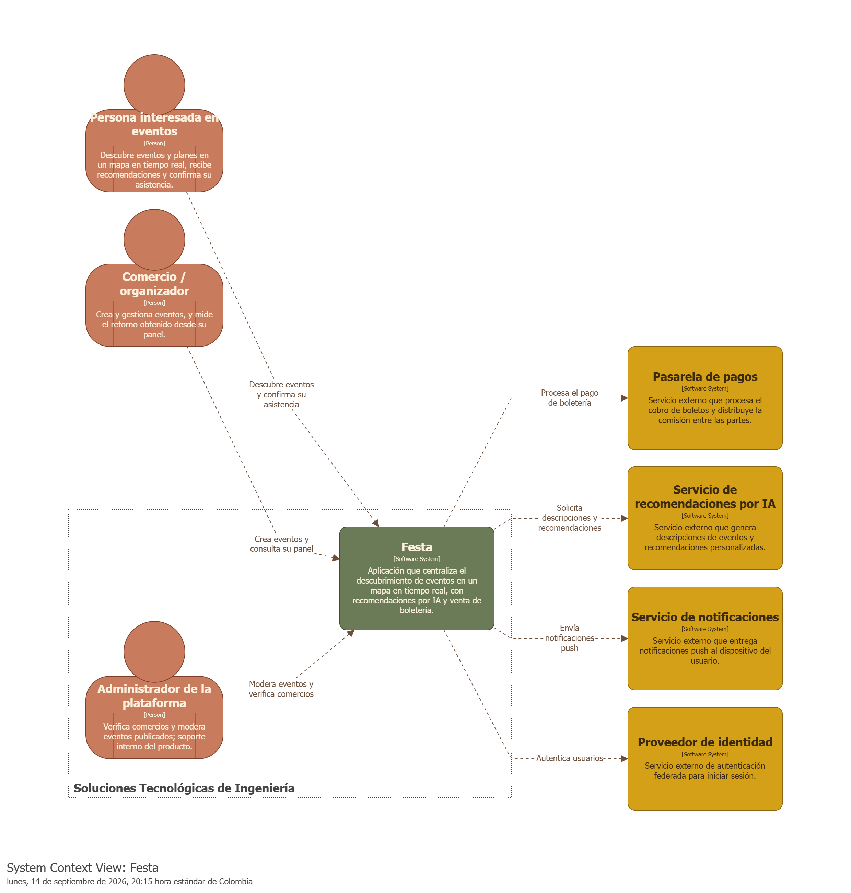

# 📄 Alcance del Sistema — Festa

Basado en `Requerimientos.docx`, el modelo C4 en [`festa.dsl`](./festa.dsl) y su vista de contexto exportada en [`diagramas/ContextoFesta.png`](./diagramas/ContextoFesta.png). Plantilla base: [`dosw-lab4-example/scope-template.md`](https://github.com/lauherrerac/dosw-lab4-example/blob/main/docs/requirements/scope-template.md).

## 1. Sistema

* **Nombre del sistema:** Festa
* **Objetivo:** El sistema tiene como objetivo centralizar el descubrimiento de eventos y planes en un mapa interactivo en tiempo real, ofrecer recomendaciones personalizadas mediante Inteligencia Artificial Generativa, y dar visibilidad a comercios y organizadores locales — validado mediante un piloto con estudiantes de la Escuela Colombiana de Ingeniería Julio Garavito (ECI).

## 2. Problema a resolver

Los planes y eventos locales se pierden entre publicaciones de redes sociales sin trazabilidad temporal clara, y los comercios pequeños no pueden competir por visibilidad frente a otros negocios sin pagar pauta publicitaria en Instagram o TikTok. Festa resuelve esto centralizando el descubrimiento de eventos en un mapa en tiempo real con recomendaciones de IA, y dando a los comercios un canal de visibilidad y monetización (boletería con comisión, posicionamiento destacado) que no depende de pauta paga en redes sociales externas.

## 3. Diagrama de Contexto

### 3.1 Diagrama

*Generado a partir de la vista `ContextoFesta` definida en [`festa.dsl`](./festa.dsl) (ver sección "Cómo visualizar o exportar los diagramas" en el [README](./README.md)).*

### 3.2 Actores

| Actor / Rol | Descripción |
|---|:---:|
| Persona interesada en eventos | Descubre eventos y planes en un mapa en tiempo real, recibe recomendaciones personalizadas y confirma su asistencia. |
| Comercio / organizador | Crea y gestiona eventos, vende boletería y mide el retorno obtenido desde su panel. |
| Administrador de la plataforma | Verifica comercios y modera eventos publicados; soporte interno del producto (equipo Festa). |

### 3.3 Sistemas externos

| Sistema | Descripción |
|---|:---:|
| Pasarela de pagos | Servicio externo (Wompi) que procesa el cobro de boletos y distribuye la comisión entre el organizador y Festa (split payment). |
| Servicio de recomendaciones por IA | Servicio externo (modelo de IA Generativa) que genera descripciones de eventos y recomendaciones personalizadas conversacionales. |
| Servicio de notificaciones | Servicio externo (Firebase Cloud Messaging) que entrega notificaciones push al dispositivo del usuario. |
| Proveedor de identidad | Servicio externo (Google OAuth2) de autenticación federada para iniciar sesión. |

## 4. Alcance del sistema

### 4.1 Dentro del sistema

- Registro e inicio de sesión de usuarios y comercios (correo o autenticación federada con Google).
- Creación, edición, cancelación y publicación de eventos en un mapa interactivo en tiempo real, con búsqueda y filtrado.
- Generación de recomendaciones personalizadas de eventos y de descripciones de eventos mediante Inteligencia Artificial Generativa.
- Validación de asistencia mediante código QR de un solo uso, escaneado al ingreso del evento.
- Venta de boletería dentro de la app, con retención de una comisión por cada entrada vendida.
- Verificación manual de comercios y moderación de eventos/usuarios reportados por parte del administrador de la plataforma.
- Notificaciones push por eventos cercanos y recordatorios de asistencia.
- Panel de comercio con conteos simples de asistentes y boletos vendidos, para medir retorno.

### 4.2 Fuera del sistema

- Procesamiento directo de pagos con tarjeta o custodia de datos de tarjetahabientes: se delega íntegramente a la pasarela de pagos externa (Wompi), evitando el alcance regulatorio de PCI-DSS.
- Infraestructura de autenticación propia: la autenticación federada (Google) se delega a un proveedor de identidad externo; solo el correo/contraseña es gestionado directamente por Festa.
- Envío físico de notificaciones push: la entrega al dispositivo se delega a Firebase Cloud Messaging; Festa solo encola y solicita el envío.
- Gamificación y economía de puntos (otorgamiento de XP, canje de puntos por descuentos, sistema de reputación con ranking e insignias): queda fuera del MVP de este semestre, es roadmap post-piloto (*Won't* en la priorización MoSCoW).
